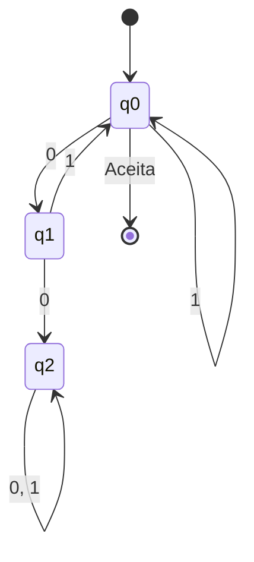
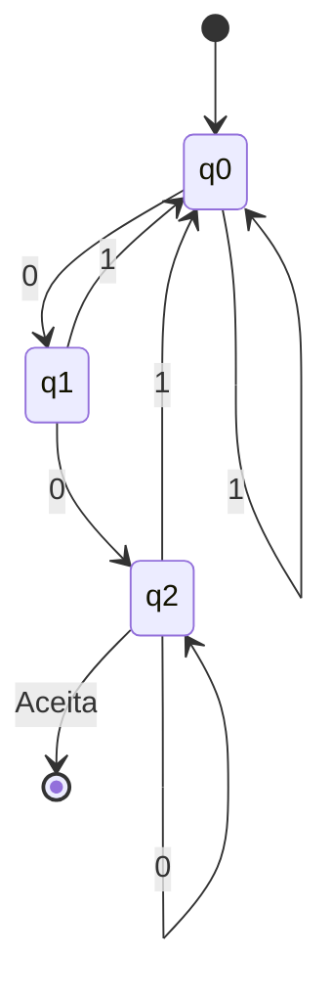
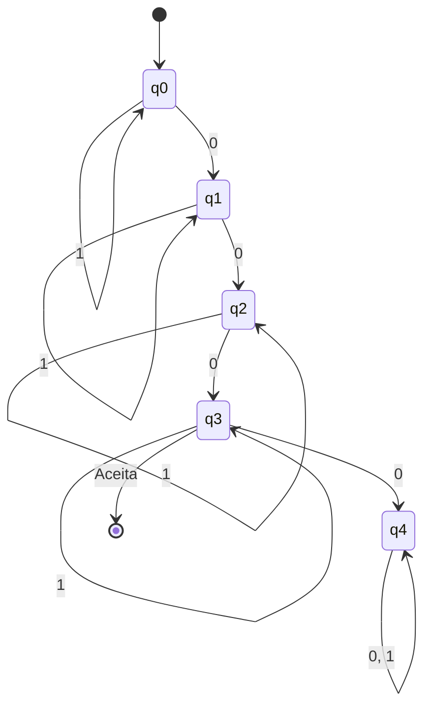
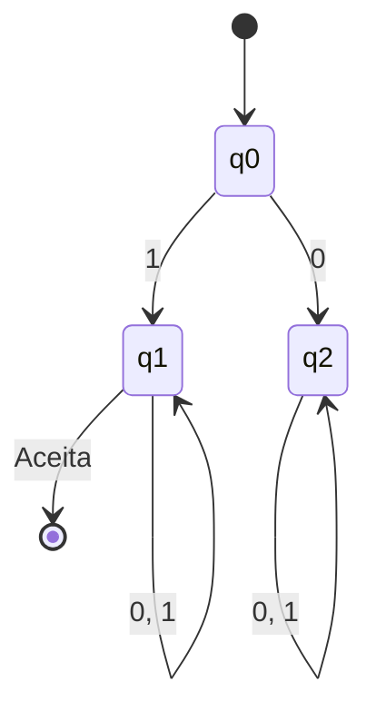
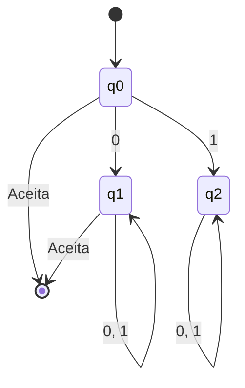

# TDE 2 - MÁQUINAS DE ESTADO FINITO E GRAMÁTICAS

**Nome:** Vinícius Matheus Sary de Lima
**Data:** 01/05/2026
**Link para o arquivo com as soluções:** [https://github.com/ViniMSLima/LFC_TDE2/Respostas_TDE2.md  ](https://github.com/ViniMSLima/LFC_TDE2/blob/main/Respostas_TDE2.md)

### QUESTÃO 1

**Pergunta:**  
Faça os diagramas de transição Máquinas de Estados Finitos Determinísticas (MEFD -0, MEFD-1, MEFD-2, MEFD-3, MEFD-4) para reconhecer cada uma das seguintes linguagens a seguir:  
a) $L_0 = \{ x \mid x \in \{0,1\}^* \text{ e cada 0 em } x \text{ é seguido por pelo menos um 1}\}$. Exemplos: 010111, 1111, 01110111011.  
b) $L_1 = \{x \mid x \in \{0,1\}^* \text{ e } x \text{ termina com } 00\}$;  
c) $L_2 = \{x \mid x \in \{0,1\}^* \text{ e } x \text{ contém exatamente 3 zeros}\}$;  
d) $L_3 = \{x \mid x \in \{0,1\}^* \text{ e } x \text{ inicia com 1}\}$;  
e) $L_4 = \{x \mid x \in \{0,1\}^* \text{ e } x \text{ não começa com 1}\}$;  

**Resposta:**  
Abaixo estão definidos formalmente os diagramas de estados para as linguagens solicitadas sobre o alfabeto $\Sigma = \{0, 1\}$.

**a) $L_0$ (MEFD-0)**
*   **Estados ($Q$):** $\{q_0, q_1, q_2\}$ | **Estado Inicial:** $q_0$ | **Estados Finais ($F$):** $\{q_0\}$
*   **Transições:** $q_0 \xrightarrow{1} q_0$, $q_0 \xrightarrow{0} q_1$, $q_1 \xrightarrow{1} q_0$, $q_1 \xrightarrow{0} q_2$ (estado morto), $q_2 \xrightarrow{0,1} q_2$


**b) $L_1$ (MEFD-1)**
*   **Estados ($Q$):** $\{q_0, q_1, q_2\}$ | **Estado Inicial:** $q_0$ | **Estados Finais ($F$):** $\{q_2\}$
*   **Transições:** $q_0 \xrightarrow{1} q_0$, $q_0 \xrightarrow{0} q_1$, $q_1 \xrightarrow{1} q_0$, $q_1 \xrightarrow{0} q_2$, $q_2 \xrightarrow{1} q_0$, $q_2 \xrightarrow{0} q_2$


**c) $L_2$ (MEFD-2)**
*   **Estados ($Q$):** $\{q_0, q_1, q_2, q_3, q_4\}$ | **Estado Inicial:** $q_0$ | **Estados Finais ($F$):** $\{q_3\}$
*   **Transições:** $q_0 \xrightarrow{1} q_0$, $q_0 \xrightarrow{0} q_1$, $q_1 \xrightarrow{1} q_1$, $q_1 \xrightarrow{0} q_2$, $q_2 \xrightarrow{1} q_2$, $q_2 \xrightarrow{0} q_3$, $q_3 \xrightarrow{1} q_3$, $q_3 \xrightarrow{0} q_4$ (estado morto), $q_4 \xrightarrow{0,1} q_4$


**d) $L_3$ (MEFD-3)**
*   **Estados ($Q$):** $\{q_0, q_1, q_2\}$ | **Estado Inicial:** $q_0$ | **Estados Finais ($F$):** $\{q_1\}$
*   **Transições:** $q_0 \xrightarrow{1} q_1$, $q_0 \xrightarrow{0} q_2$ (estado morto), $q_1 \xrightarrow{0,1} q_1$, $q_2 \xrightarrow{0,1} q_2$


**e) $L_4$ (MEFD-4)**
*(Nota: strings que não começam com 1 incluem a string vazia $\epsilon$ e strings que começam com 0).*
*   **Estados ($Q$):** $\{q_0, q_1, q_2\}$ | **Estado Inicial:** $q_0$ | **Estados Finais ($F$):** $\{q_0, q_1\}$
*   **Transições:** $q_0 \xrightarrow{0} q_1$, $q_0 \xrightarrow{1} q_2$ (estado morto), $q_1 \xrightarrow{0,1} q_1$, $q_2 \xrightarrow{0,1} q_2$


---

### QUESTÃO 2

**Pergunta:**  
Implemente, utilizando a linguagem C, C++ ou Python um programa capaz de simular cada uma destas máquinas. Observe que a simulação precisa ser da máquina (estados e transições) não de um programa equivalente.  

**Resposta:**  
A simulação exata das máquinas, caminhando estado a estado por meio das funções de transição, foi desenvolvida em Python. O código completo se encontra no link disponibilizado no cabeçalho deste documento. Para referência, abaixo está o corpo principal do simulador utilizado:

```python
class MEFD:
    def __init__(self, name, states, alphabet, transitions, start_state, accept_states):
        self.name = name
        self.states = states
        self.alphabet = alphabet
        self.transitions = transitions
        self.start_state = start_state
        self.accept_states = accept_states

    def simulate(self, string):
        current_state = self.start_state
        for char in string:
            if char not in self.alphabet:
                return False
            try:
                # Transição: (estado_atual, char) -> próximo_estado
                current_state = self.transitions[(current_state, char)]
            except KeyError:
                return False

        return current_state in self.accept_states
```
*(O script completo com as definições de dicionário para as 5 MEFDs está no arquivo `simulador_mefd.py` contido no link).*

---

### QUESTÃO 3

**Pergunta:**  
Explique a hierarquia de Chomsky para as gramáticas, destacando as características de cada uma, notadamente no que se refere as limitações impostas a criação de regras de produção. Importante, você precisa explicar a formação das regras de produção para cada uma das gramáticas na hierarquia de Chomsky com exemplos práticos.

**Resposta:**  
A Hierarquia de Chomsky é uma classificação formal que organiza as gramáticas em quatro níveis (Tipos 0 a 3). Cada nível impõe restrições mais rigorosas à formação de suas **regras de produção** do que o nível anterior. Quanto mais restrita a gramática, mais simples é o autômato capaz de reconhecer sua linguagem.

**1. Gramáticas Irrestritas (Tipo 0)**
*   **Limitações impostas:** Praticamente nenhuma restrição. A regra assume a forma $\alpha \rightarrow \beta$, onde $\alpha$ e $\beta$ são cadeias arbitrárias de variáveis (não-terminais) e terminais. A única limitação é que o lado esquerdo ($\alpha$) não pode ser vazio e precisa conter ao menos um símbolo não-terminal.
*   **Exemplo Prático:** $SAB \rightarrow baB$ | $B \rightarrow b$
*   **Autômato correspondente:** Máquina de Turing.

**2. Gramáticas Sensíveis ao Contexto (Tipo 1)**
*   **Limitações impostas:** O tamanho da cadeia gerada nunca pode ser menor que o da cadeia de origem. A regra é da forma $\alpha A \beta \rightarrow \alpha \gamma \beta$. A limitação chave é $|\alpha A \beta| \le |\alpha \gamma \beta|$ (o lado direito é maior ou igual ao esquerdo). O "contexto" ($\alpha$ e $\beta$) deve ser respeitado para que $A$ se transforme em $\gamma$.
*   **Exemplo Prático:** Útil para a linguagem $a^n b^n c^n$. 
    $aB \rightarrow ab$ | $bB \rightarrow bb$ (A variável $B$ só se transforma em $b$ dependendo do terminal que a precede).
*   **Autômato correspondente:** Autômato Linearmente Limitado (LBA).

**3. Gramáticas Livres de Contexto (Tipo 2)**
*   **Limitações impostas:** O lado esquerdo da regra **deve ser obrigatoriamente um único símbolo não-terminal**. A forma da regra é $A \rightarrow \gamma$, onde $\gamma$ é uma cadeia qualquer. Chama-se "livre de contexto" porque a substituição de $A$ independe do que está ao seu redor.
*   **Exemplo Prático:** Base da sintaxe de linguagens de programação. Gera o balanço perfeito de escopos (ex: linguagem $a^n b^n$).
    $S \rightarrow aSb$ | $S \rightarrow \epsilon$
*   **Autômato correspondente:** Autômato com Pilha (Pushdown Automaton).

**4. Gramáticas Regulares (Tipo 3)**
*   **Limitações impostas:** É a mais restrita. O lado esquerdo deve ser um único não-terminal, e o lado direito só pode conter **um terminal sozinho** ou **um terminal seguido de no máximo um não-terminal** (se linear à direita). Forma da regra: $A \rightarrow aB$ ou $A \rightarrow a$ ou $A \rightarrow \epsilon$.
*   **Exemplo Prático:** Usada para construção de Analisadores Léxicos (tokens).
    $S \rightarrow 0A$ | $A \rightarrow 1S$ | $A \rightarrow 1$ (gera padrões iterativos estritos como 010101).
*   **Autômato correspondente:** Máquina de Estados Finitos (MEFD/MEFND).
